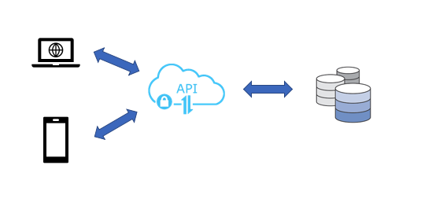
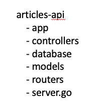
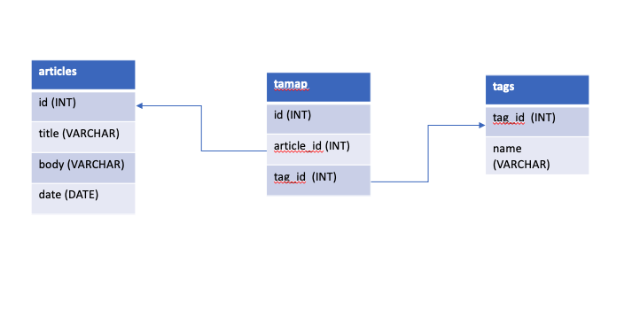

# Articles REST API

The *Articles* API provides the below endpoints,
* POST /articles - Create new articles
* GET /articles/{id} - Fetch & return article matching provided id
* GET /tags/{tagName}/{date} - Get tag related information for the date provided

## Solution Outline

### Application Design

This application is designed as a simple application that exposes REST endpoints to be consumed by clients. The application mostly uses standard packages from the Go library with
the exception of the *gorilla/mux* package which was used for the purposes of routing. Data validation on incoming url parameters are placed at the router level with the help of regex
patterns. 

Since the application is a simple REST service API, its designed and implemented as a monolith layered application. The separation of layers is based on responsibility of each layer - controller,
router, app etc. This ensures a logic separation of application functionality / logic across the multiple packages and proves easier to read and maintain. 

A single integration test file server_test.go has been created which tests the entire API end to end with a working database. I believe this closely mimics the proposed production state of the 
application and adds more value to ensuring stability of the application.    



The application is organized as multiple packages,



### Database Design

The database for the application has been modeled as 3 tables,

*   articles
*   tagmap
*   tags

Relational database was selected for this implementation because of the need to setup relations between articles tables and tags tables. MySQL is a good fit for this implementation due to its
performance and ease of use. 

The tagmap table has foreign key constraints on both the articles and tags tables.



## Assumptions
1. Database - there was no direction on the type of database to be used. I've selected a MySQL relational db for the purposes of this implementation.
2. The tags endpoint has been implemented to satisfy the below requirements
  * count - the number of times the provided tag was used on a specified date
  * articles - list of articles that contain the provided tag and were created on a specified date, limited to 10
  * related_tags - list of all tags (without duplicates and excluding the provided tag) that feature in all articles that contain the provided tag and were created on a specified date

## Programming Language
* Go
* SQL

## Tools Used
* MySQL DB
* IntelliJ GoLand IDE
* Mac OS
* Postman
* Curl

In addition to the standard packages from the Go library Open source libraries were used,
* [Gorilla Mux](https://github.com/gorilla/mux)- Application routing implementation

## Setup instructions

### Pre-requisites
* Go environment
* MySQL DB

### Database setup scripts
```sql

# Setup DB schema

CREATE DATABASE articles_store;
USE articles_store;

# Setup tables in schema

CREATE TABLE articles (
    id INT AUTO_INCREMENT PRIMARY KEY,
    title VARCHAR(50) NOT NULL,
    date DATE NOT NULL,
    body VARCHAR(500) NOT NULL,
    constraint articles_id_uindex
		unique (id)
);

CREATE TABLE tags (
    tag_id INT AUTO_INCREMENT PRIMARY KEY,
    name VARCHAR(50) NOT NULL,
    constraint tagmap_tags_tag_id_fk
		unique (tag_id),
	  constraint tags_tag_id_uindex
		unique (tag_id),
	  constraint tags_name_uindex
		unique (name)
);

CREATE TABLE tagmap (
    id INT AUTO_INCREMENT PRIMARY KEY,
    article_id INT NOT NULL,
    tag_id INT NOT NULL,
    CONSTRAINT tagmap_articles_id_fk
		foreign key (article_id) references articles (id),
    constraint tagmap_tags_tag_id_fk
		foreign key (tag_id) references tags (tag_id)
);


# Drop table

DROP TABLE articles_store.tagmap;

DROP TABLE articles_store.articles;

DROP TABLE articles_store.tags;

```

### Step by step guide
* Execute DDL scripts provided above
* Clone the repository into local workspace 
`git clone`
* Change to project directory
`cd articles-api`
* Build the application 
`go build`
* Execute tests
`go test`
* Install the application
`go install`
* Run the application by passing in appropriate command line flags
`articles-api -dbUserName=tester -dbUserPwd=testing -dbName=articles_store -port=8080`

If the app has started successfully, you should see a msg for server listening on port on the console / std.out
*Server is up and running, listening to requests on port 8080 ..*

### Interacting with the application

You can interact with the app using cURL commands.

* Create an article
```
curl -H "Content-Type: application/json" \
    -H "Accept: application/json"\
    -X POST \
   --data '{
 	"title" : "Test title",
 	"date" : "2018-11-12",
 	"body" : "Test body for the article",
 	"tags" : ["health", "fitness", "gym"]
 }' \
   http://localhost:8080/articles
```
   
* Fetch article
```
curl -H "Accept: application/json" -H "Content-Type: application/json" -X GET http://localhost:8080/articles/2
```

* Fetch tag info
```
curl -H "Accept: application/json" -H "Content-Type: application/json" -X GET http://localhost:8080/tags/home/20181112
```

Alternatively, you can import the setup files into [Postman](https://www.getpostman.com/) and test the endpoints from there.
The import file is linked at [https://www.getpostman.com/collections/51008fcd78ff0287f853](https://www.getpostman.com/collections/51008fcd78ff0287f853)
 
## Future improvements
As future scope, I would
* Implement API authentication using JWT.
* Add additional end points to update article, delete article.
